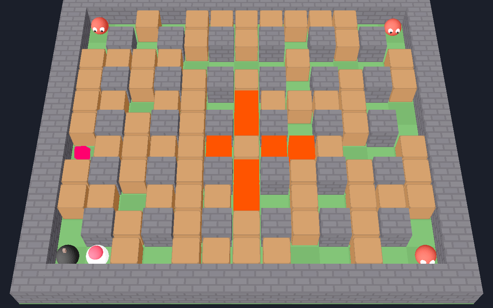

# Bomberman 3D

A 3D take on classic Bomberman, written in Python with the [Ursina](https://www.ursinaengine.org/) engine. It's also a small showcase of SOLID principles and design patterns in a game codebase.



## Features

- Random arena every round: indestructible pillars, breakable crates, 4 wandering enemies
- Bombs with a cross-shaped blast, chain reactions between bombs
- Five power-ups hidden in crates:

| Colour | Power-up | Effect |
|---|---|---|
| 🔵 Blue | Extra bomb | +1 bomb on the board at once |
| 🩷 Pink | Fire | +1 blast range |
| 🟡 Yellow | Speed | Move faster |
| 🟢 Green | Kick | Walk into a bomb to send it sliding |
| 🟣 Purple | Remote detonator | Bombs wait until you press **E** |

## Getting started

Requires Python 3.10+.

```bash
git clone https://github.com/prashant-fintech/bomberman3d.git
cd bomberman3d
python -m venv .venv
```

Activate the virtual environment:

```bash
# Windows
.venv\Scripts\activate
# macOS / Linux
source .venv/bin/activate
```

Install and play:

```bash
pip install -r requirements.txt
python main.py
```

## Controls

| Key | Action |
|---|---|
| WASD / arrow keys | Move |
| Space | Drop bomb |
| E | Detonate remote bombs |
| R | Restart |
| Esc | Quit |

**Tip:** stepping away from a bomb in a straight line keeps you in its blast. Duck around a pillar instead.

## Testing

A headless end-to-end test drives real game frames without opening a window. It covers movement, bombs, crates, power-ups, kick, remote detonation, chain reactions, winning, losing and restarting.

```bash
python tests/smoke_test.py
```

## Project layout

```
main.py                  entry point: create the app, scene and Game
bomberman/
  config.py              all tunable numbers + colour palette
  events.py              EventBus + Event enum
  board.py               grid data (walls/crates), no rendering
  world.py               live state of one round + spatial queries
  game.py                composition root + round state machine
  level.py               LevelBuilder: arena, player, enemies
  explosion.py           ExplosionSystem: bomb -> cross of flames
  rules.py               deaths, win/lose
  powerups.py            PowerUpEffect classes, weighted factory, spawner
  ai.py                  enemy Brain strategies
  controls.py            key -> Command bindings, KeyboardController
  ui.py                  HUD (event driven)
  scene.py               camera, lights, background
  entities/
    grid_mover.py        base class for cell-to-cell movement
    player.py, enemy.py, bomb.py, flame.py, powerup.py
    fuses.py             TimedFuse / RemoteFuse strategies
tests/
  smoke_test.py          headless end-to-end check
```

Gameplay numbers (grid size, fuse time, speeds, drop rates, enemy count) all live in `bomberman/config.py`.

## Design

| Pattern | Where | What it buys |
|---|---|---|
| Observer | `EventBus` | Bombs announce `BOMB_EXPLODED`; the explosion system, power-up spawner and HUD react without the bomb knowing they exist. |
| Strategy | `Fuse`, `Brain` | New bomb timing (e.g. proximity mine) or enemy AI (e.g. chaser) = one new class; `Bomb` and `Enemy` don't change. |
| Command | `controls.py` | Keys map to command objects, so rebinding or adding an action doesn't touch game logic. |
| State | `Playing` / `RoundOver` | Input and rules are gated by the current state instead of `if game_over` checks everywhere. |
| Factory | `PowerUpFactory` | Weighted random drops, skipping one-time powers the player already has. |
| Builder | `LevelBuilder` | Level generation is isolated from the game loop and can be swapped for hand-made maps. |
| Template method | `GridMover` | Shared movement; subclasses only decide where to go. |

SOLID in practice:

- **Single responsibility:** `Board` is data, `World` is round state, `Rules` judges, `Hud` draws.
- **Open/closed:** adding a power-up is one `PowerUpEffect` subclass plus an entry in `DEFAULT_EFFECTS`.
- **Liskov substitution:** every `Fuse` and `Brain` can stand in for another; `Fuse.trigger()` defaults to a safe no-op.
- **Interface segregation:** power-up effects only see `PlayerStats`, not the whole `Player`.
- **Dependency inversion:** entities get the `World` through their constructor, with no globals; `Game` is the only place that wires concrete classes together.

### Adding a power-up

Add the stat it changes to `PlayerStats` (e.g. `shield: bool = False`), then:

```python
# bomberman/powerups.py
class Shield(PowerUpEffect):
    name, color, weight = 'shield', '#ffffff', 1

    def apply(self, stats, config):
        stats.shield = True

DEFAULT_EFFECTS = (..., Shield())
```

### Adding an enemy AI

```python
# bomberman/ai.py
class ChaserBrain(Brain):
    def next_direction(self, enemy, options):
        target = enemy.world.player.cell
        return min(options, key=lambda d: manhattan(step(enemy.cell, d), target))
```

## License

[MIT](LICENSE)
